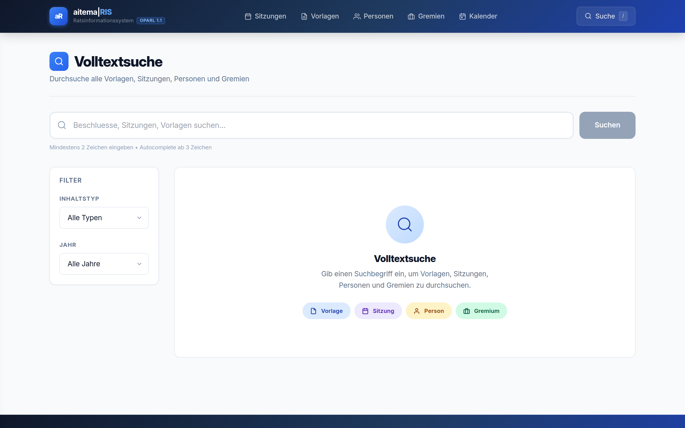
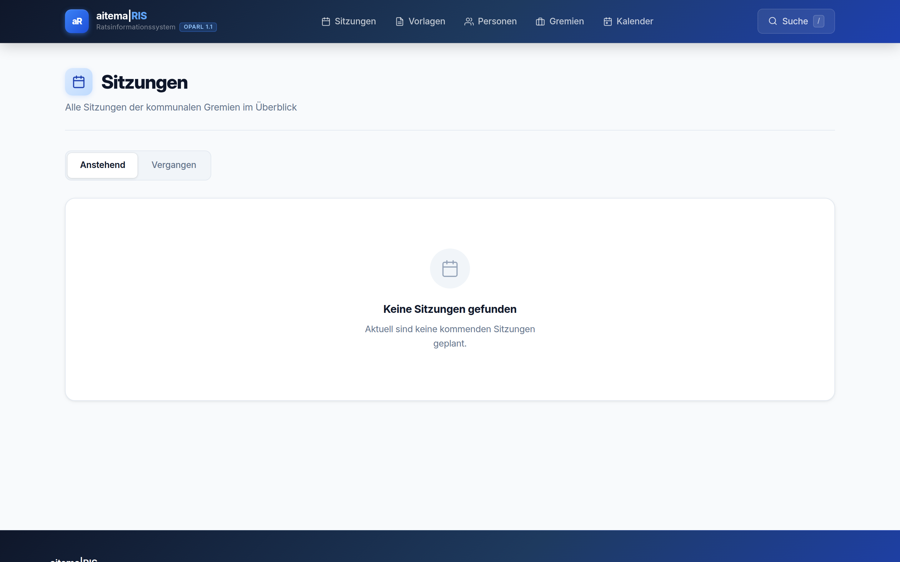
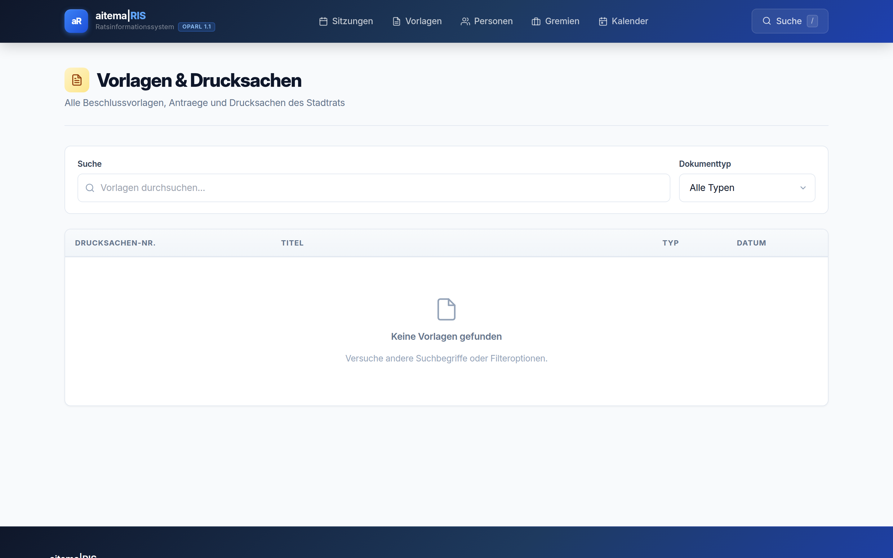
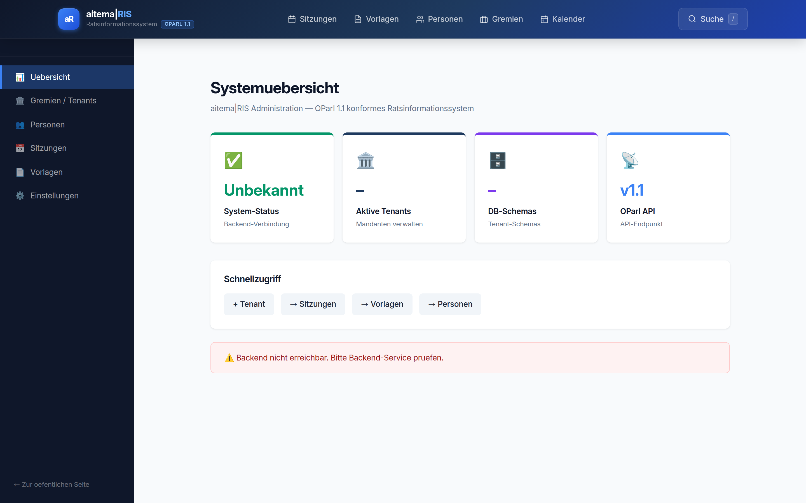

# aitema|RIS

> Modernes Ratsinformationssystem mit KI-Suche und Bürger-Transparenz-Portal.

[](https://ris.aitema.de)
[](https://ris.aitema.de)
[](https://oparl.org)
[](https://ris.aitema.de)

## Screenshots

| Startseite | Suche | Sitzungen |
|:-:|:-:|:-:|
|  |  |  |

| Vorlagen | Admin-Panel |
|:-:|:-:|
|  |  |

## Features

### Bürger-Transparenz-Portal
- **Volltext-Suche** – Elasticsearch 8.11, alle Sitzungen, Vorlagen, Personen
- **Semantische Suche** – pgvector + KI-Embeddings, findet inhaltlich Ähnliches
- **KI-Zusammenfassungen** – Claude Haiku fasst Beschlussvorlagen in 3 Sätzen zusammen
- **Einfache Sprache** – Toggle für A2-Level Texte (BFSG-konform)
- **iCal-Feed** – Ratssitzungen direkt im Kalender abonnieren
- **Abstimmungsergebnisse** – Doughnut-Chart (Ja/Nein/Enthaltung) + namentliche Abstimmung
- **OParl 1.1 API** – Offene Datenschnittstelle (Wiederverwendung durch Dritte)

### Verwaltung & Administration
- **Multi-Tenant** – Ein System, viele Kommunen (eigene PostgreSQL-Schemas)
- **Admin-Frontend** – CRUD für Gremien, Personen, Sitzungen, Vorlagen, Mandanten
- **Keycloak SSO** – Single Sign-On für alle aitema-Produkte
- **Plausible Analytics** – DSGVO-konformes Nutzungsmonitoring

## Technologie-Stack

```
Frontend:    Next.js 14 + Tailwind CSS (aitema Design System)
Backend:     FastAPI (Python) + SQLAlchemy + Alembic
Suche:       Elasticsearch 8.11 + pgvector (Semantische Suche)
KI:          Anthropic Claude Haiku (Zusammenfassungen, Einfache Sprache)
Embeddings:  Anthropic voyage-3 → pgvector (1536 dim)
Datenbank:   PostgreSQL 16 + pgvector Extension
Auth:        Keycloak OIDC/PKCE
Deploy:      Docker Compose + Traefik (Hetzner)
```

## OParl-Kompatibilität

aitema|RIS implementiert [OParl 1.1](https://oparl.org) vollständig:
- `GET /api/v1/oparl/system`
- `GET /api/v1/oparl/bodies`
- `GET /api/v1/oparl/meetings`
- `GET /api/v1/oparl/papers`
- `GET /api/v1/oparl/persons`
- `GET /api/v1/oparl/organizations`

## Architektur

```
ris.aitema.de
├── /              → Startseite (Sitzungskalender, Schnellsuche)
├── /suche         → Volltext- + Semantische Suche
├── /sitzungen     → Sitzungskalender + Detail mit Abstimmungen
├── /vorlagen      → Beschlussvorlagen mit KI-Zusammenfassung
├── /personen      → Ratsmitglieder + Gremienübersicht
├── /admin         → Admin-Panel (geschützt)
└── /api           → FastAPI + OParl-API
```

## Schnellstart

```bash
git clone https://github.com/Aitema-gmbh/ratsinformationssystem.git
cd ratsinformationssystem

# Mit Docker
docker compose up -d

# Elasticsearch Index erstellen
docker exec ris-backend python -m app.scripts.create_index
```

## Dokumentation

- [Architektur](docs/ARCHITECTURE.md)
- [PRD Features Batch 1](docs/PRD-features-2026-02.md)
- [PRD Features Batch 2](docs/PRD-features-2026-02-batch2.md)
- [PRD Features Batch 3](docs/PRD-features-2026-02-batch3.md)
- [PRD Features Batch 4](docs/PRD-features-2026-02-batch4.md)
- [OParl-API-Doku](https://ris.aitema.de/api/docs)

## Compliance

| Anforderung | Status |
|-------------|--------|
| OZG 2.0 | ✅ |
| OParl 1.1 | ✅ |
| BFSG (Einfache Sprache, WCAG 2.1 AA) | ✅ |
| EU AI Act (Human-in-the-Loop, KI-Label) | ✅ |
| DSGVO | ✅ |

---

*Entwickelt von [aitema GmbH](https://aitema.de)*
