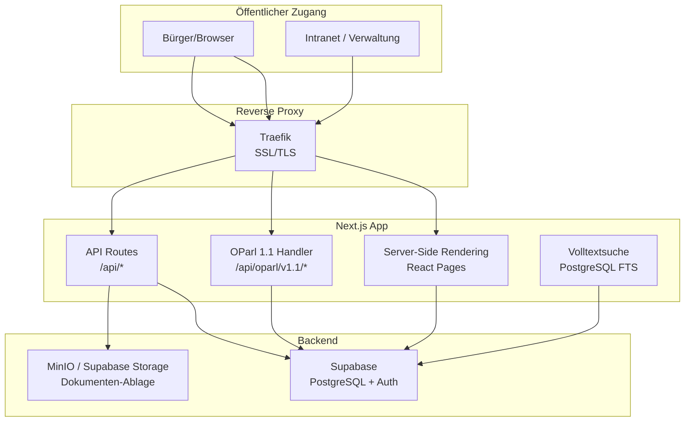
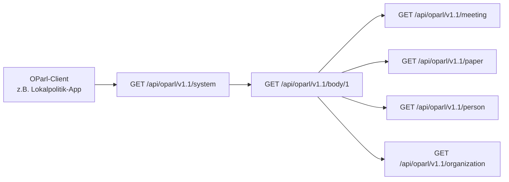
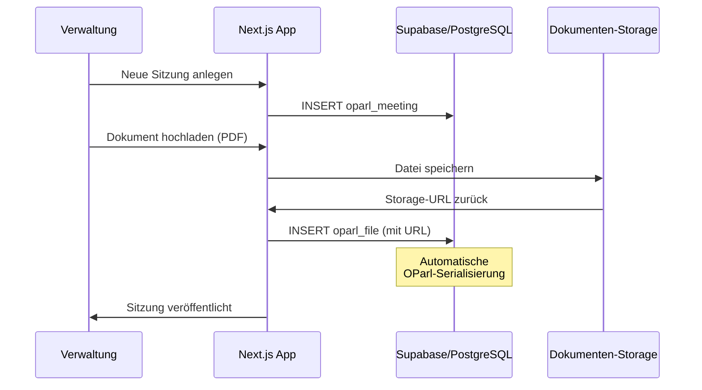
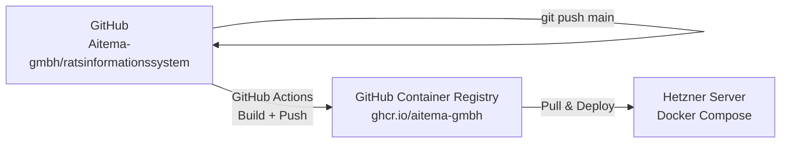

# aitema|Rats – Technische Architektur

## Übersicht

aitema|Rats ist ein Next.js-basiertes Ratsinformationssystem mit OParl 1.1 API-Konformität für kommunale Gremienarbeit.

## System-Architektur

## OParl 1.1 Konformität

## Datenfluss: Sitzungsmanagement

## Komponenten

### Next.js App (Frontend + API)
- **Framework**: Next.js 14 mit App Router
- **Rendering**: SSR + SSG für öffentliche Seiten
- **Styling**: Tailwind CSS 3.4
- **Suche**: PostgreSQL Full-Text Search (tsvector)
- **Authentifizierung**: Supabase Auth (JWT)

### OParl-Schnittstelle
- **Standard**: OParl 1.1 vollständig implementiert
- **Endpunkte**: System, Body, Organization, Person, Meeting, AgendaItem, Paper, File
- **Format**: JSON-LD
- **Paginierung**: Automatisch via cursor-based pagination

### Datenbank (Supabase)
- **PostgreSQL 15**: Hauptdatenbank auf Supabase
- **Row Level Security**: Feingranulare Zugriffssteuerung
- **Realtime**: Supabase Realtime für Live-Updates
- **Storage**: Supabase Storage für Dokumente

## Deployment

## Technologie-Stack

| Layer | Technologie | Version |
|-------|-------------|---------|
| Framework | Next.js | 14.x |
| Sprache | TypeScript | 5.x |
| Styling | Tailwind CSS | 3.4.x |
| Datenbank | Supabase (PostgreSQL) | 15.x |
| ORM | Prisma | 5.x |
| Suche | PostgreSQL FTS | nativ |
| Container | Docker | 24.x |
| Standard | OParl | 1.1 |
